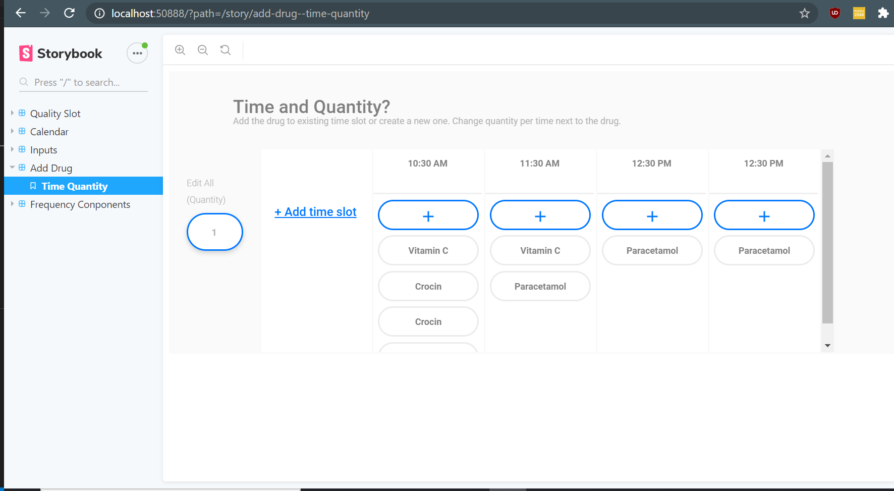

This is a starter template for [Learn Next.js](https://nextjs.org/learn).

# Kin Frontend Developer Interview Test

Hi, thank you for applying for the role of Frontend Developer. Before we can proceed with your application, we would be grateful if you could complete this challenge as it would help us get a better understanding of your technical skills. This challenge has been based off a UI design that we are implementing for our Web App.

## Requirements

An understanding of the following topics will be necessary and helpful to work on the project

1. Styled-system/ Styled Components
   - These are mainly being used to create the individual components and work in the same way as `
` and `
`.
2. CSS

## Setting up the platform

This project uses yarn, which is a package manager similar to npm, for managing dependencies.

Storybook is used to develop the individual components, and allows one to easily have a look at them in isolation. A thorough understanding of Storybook is not necessary for this test as we are only using it as a display.

1. Branch, download or clone the repo.
2. Type `yarn install` in the terminal (inside the correct directory) to download the necessary dependencies.
3. Type `yarn storybook` to launch the project in your browser.

## Background

The screen you shall be working on allows the user to add a new time slot when the drugs can be dispensed, along with adding new drugs to each time slot. However, for this challenge you need not concern yourself with the 'add new drugs to a timeslot' feature. When you open AddDrug->Time Quantity on the Storybook browser, you shall be presented with the following image:

Clicking on 'Add Time Slot' creates a new time slot like so:

However as you will notice, clicking on 'Add Time Slot' a second and third time causes the slots to overlap each other as well as reduce in width:

## The Test

We would like you to provide us with a solution that allows for an overflow (i.e. adding new slots should not cause an overlap with adjacent slots or components.). For the completion of this test you are allowed to use external libraries or create new components, so long as the appearance of the page and the individual components is maintained.

###### If you have any questions or concerns about the project, please email me at <sankalp@kinhealthcare.co>
